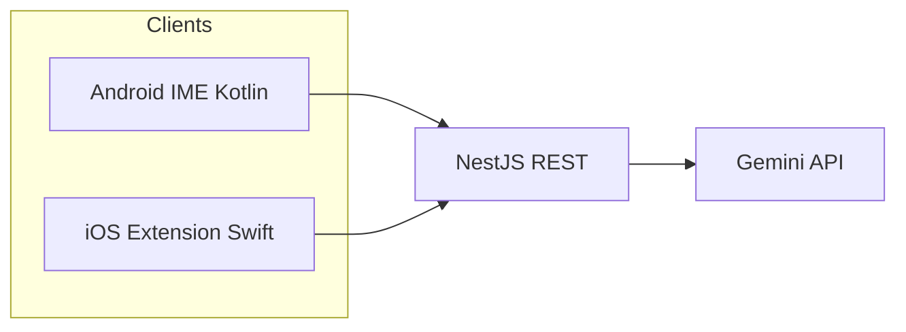

# Native AI Keyboard — Project Plan

AI-powered **custom keyboard** for Android and iOS: users fix, shorten, expand, or rewrite text **where they type**, with tone controlled by **modes** (Work, Friends, Family, Flirt). All **Gemini** calls go through a **NestJS** backend (API keys never on device).

**Schedule:** **7 days** Android + shared backend, then **7 days** iOS, then shared QA and ship. Details: [spec/roadmap.md](./spec/roadmap.md).

---

## Purpose

- Remove constant **app switching** to paste text into separate AI apps.
- Apply **consistent** tone and actions from the keyboard row (Correct · Rewrite · Shorten · Expand).
- Keep **privacy and keys** on the server; clients send only text + mode + action + locale (and optional theme for prompt shaping).

---

## Architecture (summary)



- **Clients:** Native IME only (no Flutter for the keyboard UI).
- **Backend:** Validate → rate limit → build prompt (mode × action × locale × theme) → Gemini → post-process → JSON.
- **Data:** PostgreSQL (devices, settings), Redis (rate limits). See [spec/architecture.md](./spec/architecture.md).

---

## Technology stack

| Layer | Technology |
|-------|------------|
| Android keyboard | Kotlin, `InputMethodService`, Material |
| iOS keyboard | Swift, Keyboard Extension, URLSession |
| Backend | TypeScript, NestJS, REST |
| AI | Google Gemini (e.g. flash model) |
| Database | PostgreSQL |
| Rate limit / cache | Redis |
| Deploy | Docker (recommended) |

---

## MVP features

| Area | Feature |
|------|---------|
| **Actions** | Correct, Rewrite, Shorten, Expand |
| **Modes** | Work, Friends, Family, Flirt (prompt templates differ) |
| **Locales** | Turkish and English for UI copy and model instructions |
| **Themes** | Light and dark keyboard chrome; prompt may include theme-aware tone hints |
| **Typing** | QWERTY baseline; **long-press** alternate characters (e.g. i → ı) where platform allows |
| **AI result** | **Preview** with **Accept** / **Cancel** before replacing host field text |
| **Backend** | Device token style auth, `/transform`, rate limits, structured errors |
| **Compliance** | HTTPS, minimal logging, clear iOS Full Access disclosure |

Out of scope for MVP: user-defined free-form prompts, offline on-device LLM, desktop keyboards. See [spec/overview.md](./spec/overview.md).

---

## Specification (deep dive)

| Document | Description |
|----------|-------------|
| [spec/overview.md](./spec/overview.md) | Full problem/solution, goals, risks |
| [spec/architecture.md](./spec/architecture.md) | Modules, pipeline, DB, deployment |
| [spec/api_endpoints.md](./spec/api_endpoints.md) | REST contract |
| [spec/ui_design.md](./spec/ui_design.md) | Layout zones, mockups |
| [spec/roadmap.md](./spec/roadmap.md) | 14-day breakdown (7 Android+backend, 7 iOS) |

---

## Daily analysis (what each day delivers)

| Day | Analysis |
|-----|----------|
| [Day 01](./day_01/analysis.md) | Repo, plan docs, NestJS scaffold, health |
| [Day 02](./day_02/analysis.md) | Gemini client + prompt templates |
| [Day 03](./day_03/analysis.md) | Transform API, auth stub, rate limit |
| [Day 04](./day_04/analysis.md) | Android IME skeleton + QWERTY |
| [Day 05](./day_05/analysis.md) | Android AI bar + API wiring |
| [Day 06](./day_06/analysis.md) | Android modes, themes, long-press |
| [Day 07](./day_07/analysis.md) | Android replace, preview, smoke QA |
| [Day 08](./day_08/analysis.md) | iOS extension skeleton |
| [Day 09](./day_09/analysis.md) | iOS layout parity |
| [Day 10](./day_10/analysis.md) | iOS AI bar + API |
| [Day 11](./day_11/analysis.md) | iOS modes, themes, long-press |
| [Day 12](./day_12/analysis.md) | iOS replace + preview |
| [Day 13](./day_13/analysis.md) | Settings persistence + cross QA |
| [Day 14](./day_14/analysis.md) | Delivery, demo, doc freeze |

---

## Assets

- [keyboard_default_light.png](./assets/mockups/keyboard_default_light.png) — reference keyboard mockup (light theme)

---

## Application code (implementation root)

```
trainee/projects/native_ai_keyboard/
├── backend/           # NestJS — Days 01–03
├── android-keyboard/  # Kotlin — Days 04–07
└── ios-keyboard/      # Swift — Days 08–12
```

Cross-cutting work (settings, final QA, ship) in Days 13–14 spans backend + both clients as needed.
