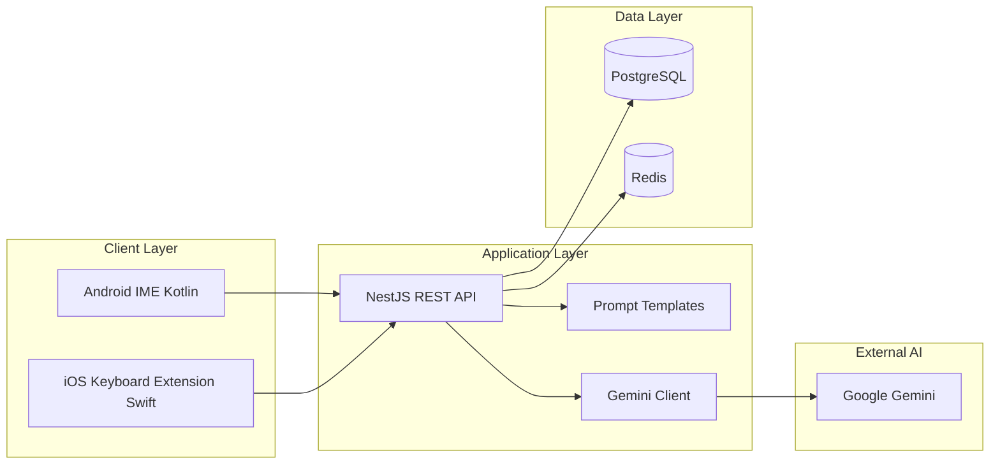
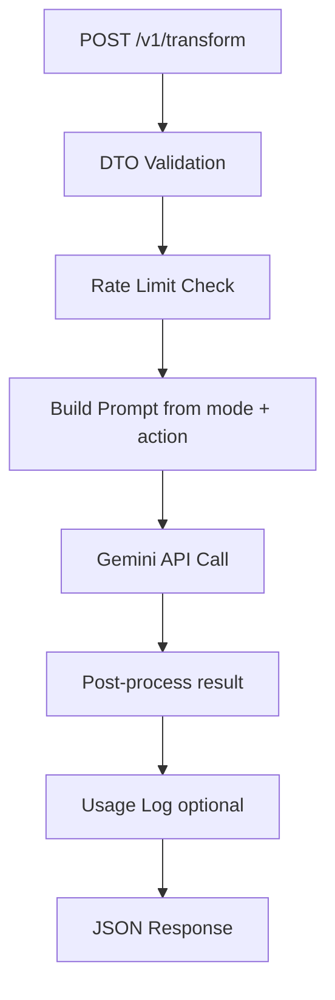

# Native AI Keyboard — System & Backend Architecture

## Overview

Native AI Keyboard consists of three main components: **Android keyboard**, **iOS keyboard**, and **NestJS backend**. Mobile clients send only text, mode, and action; AI logic and Gemini integration stay on the server.

## High-Level Diagram



## Mobile Architecture

### Android (Kotlin)

| Component | Technology | Description |
|-----------|------------|-------------|
| IME service | `InputMethodService` | System keyboard entry point |
| Layout | XML + custom `KeyboardView` | QWERTY + action bar |
| Networking | Retrofit / OkHttp | Backend REST |
| State | `SharedPreferences` | Last mode, theme |
| Theme | Resource qualifiers + runtime | Light / dark |

### iOS (Swift)

| Component | Technology | Description |
|-----------|------------|-------------|
| Extension | `KeyboardViewController` | Keyboard UI |
| Layout | Auto Layout / UIStackView | Native spacing |
| Networking | `URLSession` | Backend REST |
| State | App Group `UserDefaults` | Settings shared with companion app |
| Permission | Full Access | Required for network requests |

## Backend Architecture (NestJS)

### Module structure

```
src/
├── main.ts
├── app.module.ts
├── auth/
│   ├── auth.module.ts
│   ├── device-auth.guard.ts
│   └── device.service.ts
├── transform/
│   ├── transform.module.ts
│   ├── transform.controller.ts
│   ├── transform.service.ts
│   └── dto/
├── prompt/
│   ├── prompt.module.ts
│   └── prompt-template.service.ts
├── gemini/
│   ├── gemini.module.ts
│   └── gemini.client.ts
├── usage/
│   ├── usage.module.ts
│   └── rate-limit.guard.ts
└── settings/
    ├── settings.module.ts
    └── settings.service.ts
```

### Transform pipeline



1. Validate request (`text`, `mode`, `action`, `locale`)
2. Check device quota via Redis
3. `PromptTemplateService` builds the system prompt
4. `GeminiClient` calls the model
5. Trim and validate result length
6. Return response

### Prompt Template Service

Templates live in code or JSON files:

```typescript
// Conceptual structure
interface PromptTemplate {
  mode: 'work' | 'friends' | 'family' | 'flirt';
  action: 'correct' | 'rewrite' | 'shorten' | 'expand';
  locale: 'tr' | 'en';
  systemPrompt: string;
}
```

Each combination has its own system instruction; user text is sent as the user message.

### Gemini Client

- Model: `gemini-2.0-flash` (or current flash variant)
- Timeout: 15–30 seconds
- Retry: once on 5xx / timeout
- Env: `GEMINI_API_KEY`

### Data stores

| Store | Usage |
|-------|--------|
| **PostgreSQL** | `devices`, `settings`, `usage_logs` (optional) |
| **Redis** | Rate limit counters, short-lived cache |

### Sample tables (MVP)

**devices**

| Field | Type |
|-------|------|
| id | UUID |
| device_token | string |
| platform | android \| ios |
| created_at | timestamp |

**settings**

| Field | Type |
|-------|------|
| device_id | UUID FK |
| default_mode | string |
| theme | light \| dark \| system |
| locale | tr \| en |

## Security

- TLS 1.2+ required
- `Authorization: Bearer <device_token>` header
- Request body max size (e.g. 4 KB text)
- Rate limit: e.g. 50 requests / hour / device (MVP)
- Prefer hashed or truncated text in logs instead of raw content

## Deployment (recommended)

- Docker container (NestJS)
- Environments: `staging`, `production`
- Secrets: Gemini key, DB URL, Redis URL via vault or CI secrets
- Health check: `GET /health`

## Observability

- Structured logging (request id, latency, mode, action)
- Error rate and Gemini timeout metrics
- Post-MVP: Sentry / OpenTelemetry
